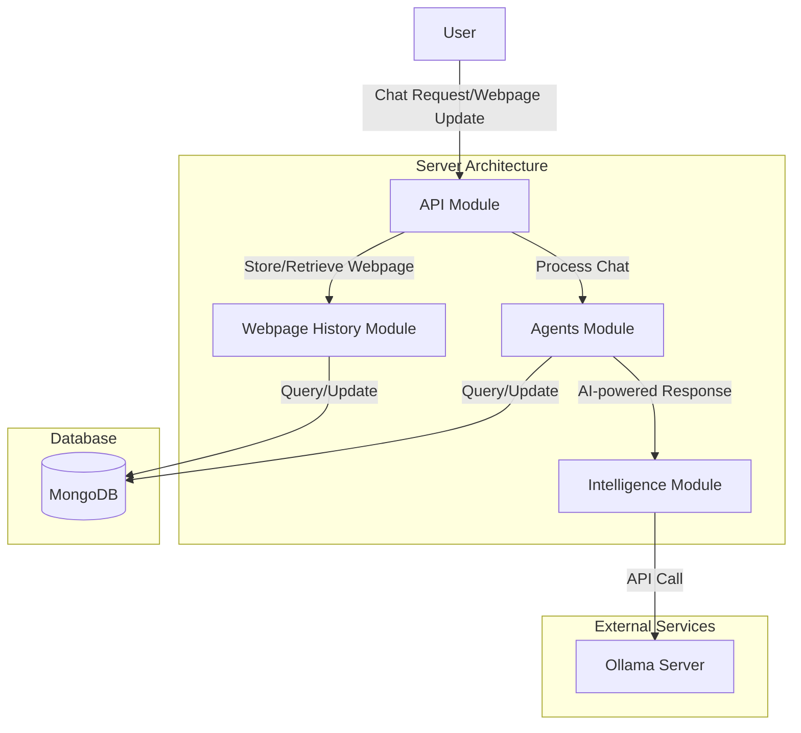

# Instalily AI Assistant

Instalily AI Assistant is a Chrome extension that provides an intelligent chatbot interface for product inquiries, troubleshooting, and customer support on e-commerce websites. The project is currently in Stage 2 of development, implementing an Agentic Graph architecture.

## Architecture

The project follows a modular architecture:



## Development Stages
### [Stage 1: Scrappy Start](docs/stage1/overview.md)
### [Stage 2: Agentic Graph Implementation](docs/stage2/overview.md)
### [Stage 3: Advanced Agentic Graph with RAG and Vector Search](docs/stage3/overview.md)

## Table of Contents

- [Project Structure](#project-structure)
- [Features](#features)
- [Installation](#installation)
- [Usage](#usage)
- [Development](#development)
- [Architecture](#architecture)
- [License](#license)

## Project Structure

The project is organized into several key components:

- `client/`: Chrome extension and React application
- `server/`: NestJS backend server
- `llama/`: Ollama server configuration for LLM integration
- `mongodb/`: MongoDB database configuration
- `docs/`: Documentation for different stages and components

## Features

- Real-time chat interface with AI-powered responses
- Webpage content analysis for context-aware assistance
- Multi-agent system for specialized query handling
- Chrome extension for seamless integration with e-commerce websites
- Scalable backend architecture with NestJS and MongoDB

## Installation

1. Clone the repository:
   ```
   git clone https://github.com/abhisekupadhyaya/Parser_Project.git
   cd Parser_Project
   ```

2. Build the project:
   ```
   make build
   ```

3. Run the server:
   ```
   make run
   ```

4. Load the Chrome extension:
   - Open Chrome and navigate to `chrome://extensions/`
   - Enable "Developer mode"
   - Click "Load unpacked" and select the `client/build` directory

## Usage

1. Visit a supported e-commerce website (e.g., https://www.partselect.com/)
2. Click on the Instalily AI Assistant extension icon
3. Interact with the chatbot for product inquiries, troubleshooting, or general assistance

## Development

### Prerequisites

- Docker
- Node.js (v14+)
- npm or yarn

### Setup

1. Install dependencies:
   ```
   cd client && npm install
   cd ../server && npm install
   ```

2. Set up environment variables:
   ```
   cp server/env.example server/.env
   ```
   Edit the `.env` file with your configuration

3. Start the development servers:
   ```
   npm start
   ```

4. For client-side development, run:
   ```
   cd client && npm run build
   ```

For more detailed information on the architecture, please refer to the [Server Overview](docs/stage2/server/overview.md) and [Client Overview](docs/stage2/client/overview.md) documentation.

## License

This project is licensed under the [MIT License](LICENSE).