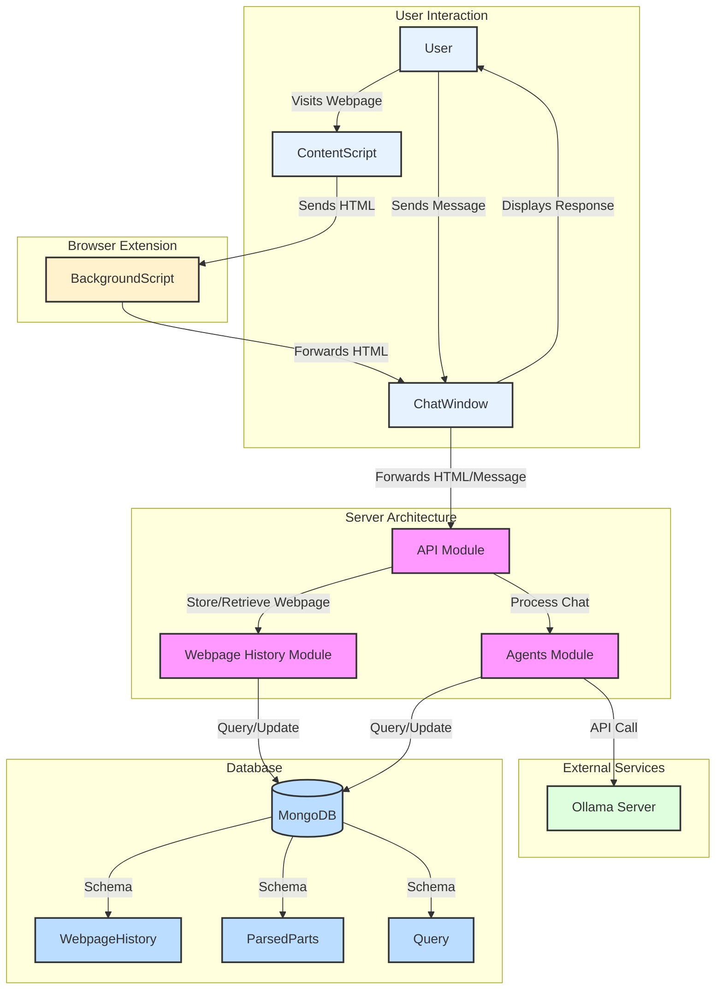

# Stage 1: Scrappy Start

This document outlines the implementation of an Appliance Part Assistant, which processes webpage content and provides an interactive chat interface for users to query about appliance parts.



### System Overview

The system consists of four main components:
1. Chrome Extension (React Frontend)
2. Backend Server (ExpressJS; NestJS)
3. MongoDB Database
4. LLM (Ollama)

## Chrome Extension (React Frontend)

### 1. Background Script (`background.js`)

This core component manages the extension's background processes and communication.

**Key Functions:**
- Implements a caching mechanism (`tabCache`) for storing and retrying message delivery
- Sets up the side panel for each tab using `chrome.sidePanel.setOptions`
- Listens for tab updates and removals, managing the extension's lifecycle
- Processes messages from content scripts and attempts to forward them to the side panel
- Retries sending cached messages every 30 seconds using `setInterval`

### 2. Content Script (`contentScript.js`)

Injected into web pages, this script captures and transmits page content.

**Key Functions:**
- Extracts the full HTML content of the current webpage using `document.documentElement.outerHTML`
- Sends the captured HTML and URL to the background script via `chrome.runtime.sendMessage`

### 3. Chat Interface (`ChatWindow.js`)

The main user interface component for the extension's chat functionality.

**Key Functions:**
- Renders the chat UI with message history using React
- Handles user input and message sending
- Processes incoming messages from the background script
- Displays AI responses and webpage information
- Uses the `marked` library to render messages with Markdown formatting
- Implements auto-scrolling to the latest message

### 4. API Module (`api.js`)

Manages communication between the extension and the backend server.

**Key Functions:**
- `sendChatMessage`: Sends user messages to the chat API
- `getAIMessage`: Retrieves AI responses for user queries
- `updateWebpage`: Sends captured webpage information to the backend
- Utilizes Axios for making HTTP requests to the backend

### Communication Flow

1. When a webpage loads, `contentScript.js` captures the HTML and sends it to `background.js`.
2. `background.js` attempts to forward this information to the side panel (`ChatWindow.js`).
3. If successful, `ChatWindow.js` processes the HTML update and sends it to the backend via `api.js`.
4. User messages entered in `ChatWindow.js` are sent to the backend using `api.js`.
5. AI responses are retrieved from the backend and displayed in the chat interface.

Based on the provided code, here's a revised documentation for the backend server:

## Backend Server (ExpressJS; NestJS)

The backend server is built using NestJS, a progressive Node.js framework. It handles chat interactions, webpage updates, and integrates with an LLM (Ollama) for processing queries.

### Key Components:

#### Chat Controller

The Chat Controller handles incoming HTTP requests related to chat functionality and webpage updates.

**Endpoints:**
- `POST /:chatId`: Processes chat requests
- `POST /:chatId/update-webpage`: Updates webpage information

#### Chat Service

The Chat Service acts as an intermediary, coordinating between the Chat Controller, Agents Service, and Webpage History Service.

**Key Functions:**
- `processChatRequest`: Handles chat queries by delegating to the Agents Service
- `updateWebpage`: Manages webpage updates, involving both the Webpage History Service and Agents Service

#### Agents Service

The Agents Service manages the interaction between the application and the LLM (Ollama).

**Key Functions:**
- `completeChat`: Processes chat queries using the Query Service
- `createChat`: Initializes or updates chat sessions

#### Query Service

The Query Service handles the creation and retrieval of chat sessions, and processes queries using Ollama.

**Key Functions:**
- `processQueryRequest`: Processes user queries, integrating parsed webpage content if available
- `createChat`: Creates or updates chat sessions
- `getOrCreateQueryDocument`: Retrieves or creates a query document for a given chat ID
- `getOllamaResponse`: Interacts with the Ollama LLM to get responses

#### Webpage History Service

The Webpage History Service manages the storage, retrieval, and processing of parsed webpage content.

**Key Functions:**
- `create`: Stores or updates webpage history
- `findOne`: Retrieves webpage history for a given URL
- `getProcessedProductInfo`: Processes and stores detailed product information from parsed webpage content

###### Data Models:

- **Query**: Represents a chat session, including messages and associated webpage URL
- **WebpageHistory**: Stores parsed webpage content and associated metadata
- **ParsedParts**: Stores processed product information extracted from webpage content

##### Key Features:

- **Chat Session Management**: The system maintains chat sessions, allowing for contextual conversations.
- **Webpage Content Integration**: Parsed webpage content is integrated into chat queries for more informed responses.
- **Product Information Extraction**: The system extracts and processes detailed product information from webpages, including symptoms, compatibility, and related parts.
- **LLM Integration**: Ollama is used for generating responses to user queries.

##### API Structure:

The API is structured under the `/api/chat` path, handling chat-related operations and webpage updates.

This backend architecture provides a robust foundation for managing chat interactions, integrating webpage content, and leveraging LLM capabilities for enhanced user experiences.

## MongoDB Database

The database stores two main types of data:

1. Webpage history (including parsed content)
2. Chat histories (queries)

### Data Models:

**Webpage History**:
```typescript
{
  pageUrl: string;
  product: string;
  parsedContent: string;
  timestamp: Date;
}
```

**Parsed Parts**:
```typescript
{
  pageUrl: string;
  title: string;
  partSelectNumber: string;
  manufacturerPartNumber: string;
  manufacturer: string;
  forBrands: string;
  description: string;
  symptoms: string[];
  worksWithProducts: string;
  worksWithInfo: Array<{ brand: string; modelNumber: string; description: string }>;
  replacedParts: string;
}
```

**Query (Chat History)**:
```typescript
{
  chatID: string;
  messages: [
    {
      role: string;
      content: string;
      timestamp: Date;
    }
  ];
  pageUrl: string;
}
```

## LLM (Ollama)

The system uses Ollama with the `llama3.2:3b` model for generating responses to user queries.

## Workflow

1. **HTML Capture and Processing**:
   - The content script captures the webpage HTML and sends it to the background script.
   - The background script forwards the HTML to the side panel (ChatWindow).
   - ChatWindow sends the HTML to the backend for processing and storage.

2. **Query Processing**:
   - User queries are sent to the backend via the ChatWindow.
   - The QueryService retrieves the relevant parsed webpage content.
   - The query, along with the parsed content, is sent to Ollama for processing.

3. **Response Generation**:
   - Ollama generates a response based on the query and parsed content.
   - The response is stored in the database and sent back to the frontend.

4. **Display and Interaction**:
   - The ChatWindow displays the response to the user and allows for further interaction.