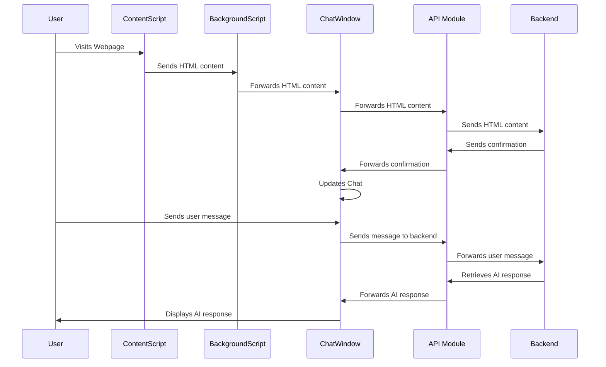

# Client Overview

## Architecture

The client-side application is structured as a React-based Chrome extension with three main components:

1. [React Application](./ReactComponent.md)
2. [Chrome Extension](./ExtentionComponent.md)

## React Application

The React application serves as the user interface for the AI assistant, primarily consisting of a chat window.

### Key Components:

1. **App Component (App.js)**: The main entry point of the application that renders the chat interface.

2. **ChatWindow Component (ChatWindow.js)**: The core component that manages the chat interface, including:
   - Message display and management
   - User input handling
   - Integration with Chrome extension messaging
   - Markdown rendering for messages

3. **API Module (api.js)**: The API module handles communication with the backend server. The functionality includes:
   - `sendChatMessage`: Sends a chat message to a specific chat ID
   - `getAIMessage`: Retrieves an AI-generated message
   - `updateWebpage`: Updates webpage information on the server

### Features:

- Real-time chat interface
- Markdown support for rich text messages
- Auto-scrolling to the latest message
- Error handling and display

## Chrome Extension

The Chrome extension facilitates communication between web pages and the React application.

### Key Components:

1. **Background Script (background.js)**: Manages communication and caching:
   - Maintains a cache of HTML content for each tab
   - Implements a retry mechanism for message sending
   - Sets up the side panel for non-chrome URLs
   - Handles tab removal and cache cleanup

2. **Content Script (contentScript.js)**: Captures and sends webpage HTML:
   - Extracts the entire HTML content of the current page
   - Sends the HTML and URL to the background script

3. **Manifest File (manifest.json)**: Defines the extension's properties and permissions

### Features:

- HTML content capture from specified websites
- Side panel integration
- Message caching and retry mechanism
- Tab-specific data management

## Workflow

1. User visits a webpage (e.g., https://www.partselect.com/)
2. Content script captures the HTML and sends it to the background script
3. Background script forwards the HTML to the React application
4. ChatWindow component processes the HTML and updates the chat interface
5. User interacts with the chat interface, sending messages
6. API module communicates with the backend to retrieve AI-generated responses
7. ChatWindow displays the AI responses to the user

## Security Considerations

- Content Security Policy in manifest.json
- Limited host permissions
- Potential XSS vulnerabilities due to `dangerouslySetInnerHTML` usage

## Limitations and Potential Improvements

1. Implement dynamic chat IDs for better session management
2. Enhance input validation and content sanitization
3. Improve error handling and user feedback mechanisms
4. Implement support for longer chats with word streaming
5. Optimize API timeout settings
6. Refine caching and routing methods in the Chrome extension
7. Make the retry interval for cached messages configurable

This overview provides a high-level understanding of the client-side application architecture, its key components, features, and potential areas for improvement.