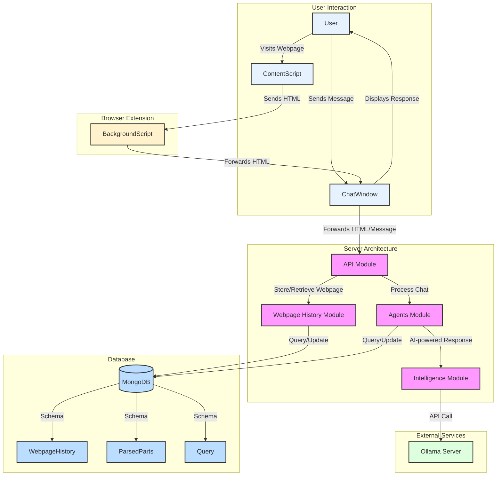

# Stage 2: Agentic Graph Implementation

This stage builds upon the scrappy implementation from Stage 1, introducing an Agentic Graph Architecture that manages a network of specialized agent nodes using bare LLM calls. This approach enhances the chatbot's capabilities and flexibility without introducing advanced technologies like RAG or vector databases yet.

### [Extension Architecture](./client/overview.md)

#### [Chrome Extension Components](./client/ExtentionComponent.md)

**Content Script**
- Fetches HTML content from the active web page
- Sends the fetched HTML to the background script

**Background Script**
- Receives HTML content from the content script
- Routes the content to the appropriate React side panel

**Manifest File**
- Defines extension permissions and script declarations
- Specifies side panel configuration

#### [React Side Panel](./client/ExtentionComponent.md)

**API Layer**
- Manages connections to the backend services
- Handles data fetching and state management

**Component Layer**
- Houses the chat application components
- Renders the user interface for the side panel

### [Backend Architecture](./server/overview.md)

The backend is composed of four primary modules:

**[Agent Module](./server/agents/overview.md)**
- Manages and coordinates AI agents
- Handles agent-specific logic and tasks

**[Webpage Module](./server/webpage/overview.md)**
- Processes incoming webpage content
- Implements caching mechanisms for efficient data retrieval

**[Intelligence Module](./server/intelligence/overview.md)**
- Provides interfaces to LLM and other AI models
- Handles natural language processing tasks

**[API Module](./server/api/overview.md)**
- Exposes endpoints for frontend communication
- Manages authentication and request routing

### Data Flow

1. User navigates to a webpage
2. Content script extracts HTML
3. HTML is sent to background script
4. Background script routes content to React side panel
5. React app processes the content through its API layer and sends it to the backend
6. Requests are sent to the backend API module
7. Backend processes requests, utilizing various modules as needed
8. Results are returned to the React app for display

### Key Technologies

- **Frontend**: React, Chrome Extension APIs
- **Backend**: Nest.js with Express.js
- **AI/ML**: The system uses Ollama with the `llama3.2:3b` model for generating responses to user queries.

### Security Considerations

- Implement secure communication between extension components using Chrome's message passing system
- Ensure proper data sanitization for webpage content using DOMPurify
- Use HTTPS for all API communications
- Implement user authentication and authorization in the backend using JSON Web Tokens (JWT)

### Performance Optimization

- Optimize content script for minimal impact on page load times using asynchronous operations
- Implement efficient caching strategies in the Webpage Module
- Use lazy loading for React components when possible, leveraging React.lazy() and Suspense

### Future Enhancements

- Implement real-time updates for chat functionality using WebSockets
- Expand AI capabilities through additional models in the Intelligence Module, such as BERT for named entity recognition
- Develop a user settings interface for customization options, including theme preferences and AI model selection