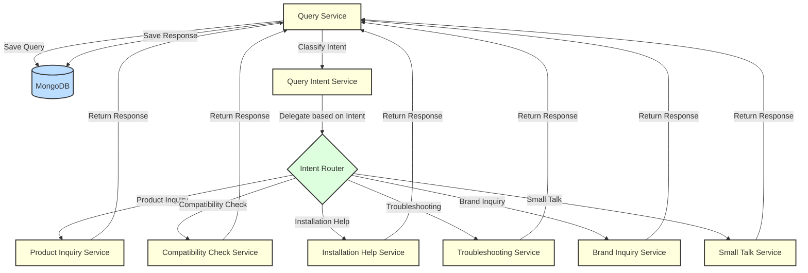

# Agents Module Documentation

The Agents Module is a central component that orchestrates various specialized services to handle different types of user queries in a chat-based system. It provides a unified interface for processing user messages, determining their intent, and generating appropriate responses using AI-powered services.



## AgentsService

The `AgentsService` is the core service of the Agents Module, responsible for coordinating the processing of user queries across different specialized services.

### Methods

#### completeChat

```typescript
async completeChat(chatId: string, chatQuery: string): Promise<{ success: boolean; role: string; content: string }>
```

Processes a user's chat message and generates an appropriate response.

##### Parameters

- `chatId`: string (Unique identifier for the chat session)
- `chatQuery`: string (User's message)

##### Process

1. Classifies the user's intent using `QueryIntentService`.
2. Processes the user query using `QueryService`.
3. Based on the classified intent, calls the appropriate specialized service to generate a response.
4. Processes the generated response using `QueryService`.
5. Returns the processed response.

##### Error Handling

- Catches and logs any errors that occur during processing.
- Throws the error for higher-level error handling.

#### createChat

```typescript
createChat(chatId: string, pageUrl: string): Promise<{ success: boolean; message: string; chatId: string; pageUrl: string }>
```

Creates a new chat session.

##### Parameters

- `chatId`: string (Unique identifier for the new chat session)
- `pageUrl`: string (URL associated with the chat session)

##### Process

Delegates the chat creation to the `QueryService`.

## AgentsModule

The `AgentsModule` is responsible for organizing and providing the `AgentsService` and its dependencies.

### Imports


- [`QueryModule`](./query.md): Manages chat sessions and message history
- [`QueryIntentModule`](./query-intent.md): Classifies user intents
- [`ProductInquiryModule`](./product-inquiry.md): Processes product-specific inquiries
- [`CompatibilityCheckModule`](./compatibility-check.md): Checks part compatibility
- [`InstallationHelpModule`](./installation-help.md): Provides installation guidance
- [`TroubleshootingModule`](./troubleshooting.md): Offers troubleshooting assistance
- [`BrandInquiryModule`](./brand-inquiry.md): Handles brand-related queries
- [`SmallTalkModule`](./small-talk.md): Handles general conversation

### Providers

- `AgentsService`

### Exports

- `AgentsService`

## Usage

To use the Agents Module in other parts of the application:

1. Import the `AgentsModule` in the desired module.
2. Inject the `AgentsService` into the constructor of the class where it's needed.

## Performance Considerations

- The `completeChat` method involves multiple asynchronous operations, including intent classification and AI-generated responses, which may impact response times.
- Error handling and logging are implemented to help diagnose issues in production.

## Future Enhancements

1. Implement caching mechanisms to improve response times for frequent queries.
2. Add support for concurrent processing of multiple intents.
3. Implement a feedback loop to improve intent classification and response quality over time.
4. Support for word streaming.

## Notes

- The module is designed to be extensible, allowing easy addition of new specialized services for handling different types of queries.
- The use of dependency injection allows for easy testing and modular development.