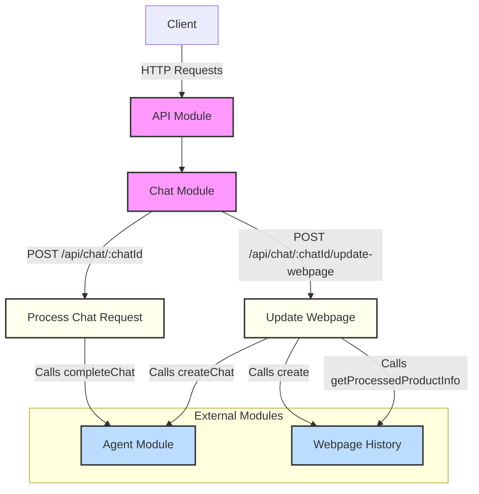

# API Module Documentation

This documentation provides a comprehensive overview of the API Module, which handles chat-related operations and integrates with the Agents and WebpageHistory services.



## Service Overview

The Chat Module manages chat requests, processes user queries, and handles webpage updates. It utilizes the AgentsService for chat processing and the WebpageHistoryService for managing webpage content.

## API Endpoints

### Process Chat Request

```http
POST /api/chat/:chatId
```

Processes a chat request for a given chat session.

#### Parameters

- `chatId`: string (Path parameter, unique identifier for the chat session)

#### Request Body

```json
{
  "chatQuery": "string"
}
```

#### Response

Returns the result of processing the chat request.

### Update Webpage

```http
POST /api/chat/:chatId/update-webpage
```

Updates webpage information and creates a new chat session.

#### Parameters

- `chatId`: string (Path parameter, unique identifier for the chat session)

#### Request Body

```json
{
  "pageUrl": "string",
  "product": "string",
  "parsedContent": "string"
}
```

#### Response

Returns the result of creating a new chat session.

## ChatModule

The `ChatModule` is responsible for organizing and providing the `ChatService` and its dependencies.

### Imports

- `AgentsModule`: Provides chat processing capabilities
- `WebpageHistoryModule`: Manages webpage content and history

### Controllers

- `ChatController`: Handles HTTP requests for chat operations

### Providers

- `ChatService`

## Implementation Details

- Uses NestJS dependency injection for modular design.
- Integrates with `AgentsService` for chat processing and `WebpageHistoryService` for webpage management.
- Implements RESTful API endpoints for chat operations.

## Usage

To use the Chat Module in other parts of the application:

1. Import the `ChatModule` in the desired module.
2. Inject the `ChatService` into the constructor of the class where it's needed.

Example:

```typescript
import { ChatService } from './chat/chat.service';

@Injectable()
export class SomeService {
  constructor(private chatService: ChatService) {}

  async someMethod(chatId: string, query: string) {
    const result = await this.chatService.processChatRequest(chatId, query);
    // Use the result as needed
  }
}
```

## Performance Considerations

- The `updateWebpage` method involves multiple asynchronous operations, including webpage history creation and product information processing, which may impact response times.
- Consider implementing caching mechanisms for frequently accessed webpage data to improve performance.

## Future Enhancements

1. Implement real-time chat capabilities using WebSockets.
2. Add support for chat history retrieval and management.
3. Add support for multimedia content in chat messages.
5. Implement analytics and reporting features for chat interactions.

## Notes

- The Chat Module is designed to be extensible, allowing easy integration with additional services or features in the future.
- Error handling should be implemented at the application level to manage potential exceptions during chat processing or webpage updates.
- The module currently assumes a one-to-one relationship between chat sessions and webpages. Consider extending the functionality to support multiple webpages per chat session if needed.