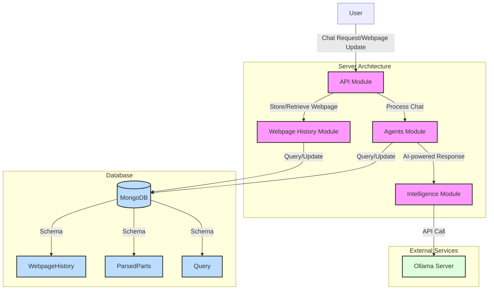

## Server Overview Technical Document

This document provides a comprehensive technical overview of the server architecture, which consists of several interconnected modules designed to handle webpage history management, chat processing, and AI-powered intelligence.

### Architecture Overview

The server is built using a modular approach, leveraging NestJS as the primary framework. It incorporates the following key modules:

1. [Webpage History Module](./webpage/overview.md)
2. [Intelligence Module](./intelligence/overview.md)
3. [Chat Module](./api/overview.md)
4. [Agents Module](./agents/overview.md)

These modules work together to provide a robust backend for managing webpage content, processing chat requests, and integrating AI capabilities.

### Module Descriptions

#### Webpage History Module

The Webpage History Module is responsible for storing and retrieving webpage content and parsed product information.

Key features:
- MongoDB integration using Mongoose
- HTML parsing with Cheerio
- CRUD operations for webpage history entries
- Product information processing

#### Intelligence Module

The Intelligence Module integrates Ollama's AI capabilities, specifically using the Llama 3.2 3B model for chat completion.

Key features:
- Ollama client integration
- Chat completion using Llama 3.2 3B model
- Configurable Ollama server URL

#### Chat Module

The Chat Module manages chat requests, processes user queries, and handles webpage updates.

Key features:
- RESTful API endpoints for chat operations
- Integration with Agents and WebpageHistory services
- Chat session management

#### Agents Module

The Agents Module handles chat processing and integrates with other services.

Key features:
- Chat processing capabilities
- Integration with other modules for comprehensive request handling

### Data Flow

1. User initiates a chat request or webpage update.
2. The Chat Module receives the request and coordinates with other modules.
3. For webpage updates, the Webpage History Module stores and processes the content.
4. Chat requests are processed by the Agents Module, which may utilize the Intelligence Module for AI-powered responses.
5. The Chat Module returns the processed results to the user.

### API Endpoints

The server exposes the following main API endpoints:

1. `POST /api/chat/:chatId`: Process a chat request
2. `POST /api/chat/:chatId/update-webpage`: Update webpage information and create a new chat session

### Database Schema

The server uses MongoDB with the following main schemas:

1. WebpageHistory
2. ParsedParts

These schemas store webpage content, product information, and parsed data.

### Performance Considerations

- Asynchronous operations are used throughout to prevent blocking.
- Indexes are implemented on frequently queried fields for optimized database performance.
- Consider implementing caching mechanisms for frequently accessed data.

### Security

- Implement proper authentication and authorization mechanisms for API endpoints.
- Ensure secure communication with the Ollama server.
- Implement input validation and sanitization for all user inputs.

### Future Enhancements

1. Implement real-time chat capabilities using WebSockets.
2. Add support for different AI models and RAG (Retrieval-Augmented Generation).
3. Implement caching mechanisms for frequently used queries and webpage data.
4. Add support for streaming responses from the AI model.
5. Implement versioning for webpage histories to track changes over time.
6. Add backend scraping capabilities to update webpage content automatically.

### Deployment

The server can be deployed using containerization technologies like Docker, ensuring consistency across different environments. Consider using orchestration tools like Kubernetes for managing deployments in production environments.

### Monitoring and Logging

Implement comprehensive logging throughout the application to facilitate debugging and monitoring. Consider integrating with monitoring tools like Prometheus and Grafana for real-time performance insights.

### Conclusion

This server architecture provides a scalable and modular foundation for managing webpage content, processing chat requests, and integrating AI capabilities. By leveraging NestJS, MongoDB, and Ollama, it offers a robust solution that can be easily extended and maintained as the application grows.